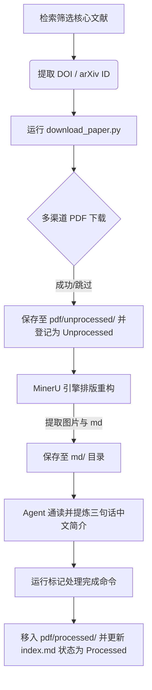

<p align="center">
  
  <strong style="font-size:2.5em; vertical-align:middle;">Academic-Search Skill</strong>
</p>

<p align="center">面向 AI 智能体与学术研究人员的下一代学术检索、自动获取、文档 OCR 解析与文献数据库同步系统。</p>

<p align="center">
  
  
  
  
</p>

---

## 🌟 核心特性

Academic-Search 旨在打破大语言模型在学术调研中的“幻觉”与“断档”，解决学术检索、文献下载、文档转换与整理的痛点。

*   🌐 **多源智能检索**：级联 arXiv, Semantic Scholar, OpenAlex, Crossref, Unpaywall, PubMed, Google Scholar 与 CNKI 等，提供跨学科学术路由与布尔 Query 扩展。
*   🚀 **时效性优先排序**：近 6 个月发表的新文献 `[新]` 置顶，同时间段按引用量和 Venue 等级排序，确保学术前沿与经典传承均不被埋没。
*   📑 **高可用文献下载**：自适应 Sci-Hub 活跃镜像轮询，内置基于 PoW (Proof of Work) 机制的 **Altcha 验证码破译器**，突破商业出版商付费墙。
*   ✍️ **结构化 OCR 排版重建**：深度集成本地 **MinerU** 排版分析引擎，实现 PDF 到结构化 Markdown 及关联图片目录的一键高保真重建。
*   🧹 **数据库安全同步 (`--sync_db`)**：基于归一化**最长公共前缀（LCP）**匹配算法，安全区分特殊字符转义或长标题截断的图片文件夹，彻底杜绝孤立文件，实现数据库精细净化。
*   🎯 **本地索引全自动流转**：自动创建/更新 `index.md` 索引，支持 `未处理 (Unprocessed) -> 已处理 (Processed)` 的自动化生命周期状态流转与三句话学术中文简介登记。

---

## 🛠️ 文献自动化转换与归档工作流 (Workflow)

当发起文献检索调研并选定核心文献后，系统支持全自动、无感知的闭环归档处理流程：



---

## 🚀 快速上手

### 1. 克隆与环境检查
将项目克隆到技能目录或工作目录中，并执行前置依赖检查：
```bash
# 克隆仓库（建议使用您的个人 Fork 仓库以推送更新）
git clone git@github.com:rygan-code/academic-search.git ~/.gemini/config/skills/academic-search

# 运行依赖检查与 CDP 服务守护进程启动
bash ~/.gemini/config/skills/academic-search/scripts/check-deps.sh
```

### 2. 文献数据库一键下载与归档
当您想要对某篇文献进行一键下载、OCR 排版分析与归档管理时：
```bash
# 1. 自动从 OpenAccess/Sci-Hub 镜像库下载 PDF 到 pdf/unprocessed 目录，并登记在 index.md 中为 Unprocessed
python scripts/download_paper.py --doi 10.1038/354056a0

# 2. 本地 MinerU 引擎（或在 AI 智能体配合下）将该 PDF 转换为高保真 Markdown，输出到 md/ 目录下
# 3. 阅读该 Markdown 并编写三句话学术简介，运行标记命令，自动移动 PDF 至 processed/ 且更新状态为 Processed
python scripts/download_paper.py --mark_processed --filename "1991-Iijima-Carbon-Nanotubes.pdf" --summary "本文报道了螺旋碳管的发现；利用高分辨透射电镜首次观测到针状多壁碳纳米管；开创了碳纳米材料的现代研究。"
```

### 3. 对 Claude Code 的唤醒指令
在智能体控制台里，您可以直接使用自然语言驱动上述全自动工作流：
> * “检索 2023 年以来关于 Time Series Agent 引用量最高的 10 篇论文，输出轻量表格。”
> * “自动将这 5 篇核心文献的 PDF 下载并处理成 Markdown，写入索引数据库，最后提炼出三句话中文简介。”

---

## 🧩 MinerU MCP 服务配置教程

为了在工作流中自动将下载的 PDF 文献转换成排版高保真的 Markdown 文本，本 Skill 需要配合 **MinerU MCP 服务** 运行。

### 1. 获取 MinerU API Key
1. 访问 [MinerU 官网](https://mineru.net) 并注册/登录。
2. 导航至个人中心或 API 管理页面，复制您的 **API Key**。

### 2. 配置 MCP 客户端
在您的客户端配置文件中（例如 `%APPDATA%\Claude\claude_desktop_config.json` 或本地智能体 MCP 配置文件中），注册 `mineru` 服务并注入 API 密钥：

```json
{
  "mcpServers": {
    "mineru": {
      "command": "uvx",
      "args": ["mineru-mcp-server"],
      "env": {
        "MINERU_API_KEY": "您的-mineru-api-key-在此"
      }
    }
  }
}
```

*提示：运行后，智能体会自动发现并调用 `mineru` MCP 服务中的上传与下载工具。*

---

## 📘 核心 CLI 命令指南

除了智能体全自动调用外，你也可以将本项目作为功能完备的 CLI 工具包直接使用。

### 1. 学术检索 CLI (ArXiv / OpenAlex)
```bash
# 检索 ArXiv 论文并输出结构化 JSON
python scripts/search_arxiv.py --query "graph neural network" --limit 10

# 检索 OpenAlex 文献
python scripts/openalex_cli.py filter works --search "diffusion models"
```

### 2. 文献自动下载与库清理工具 (`download_paper.py`)
```bash
# 按 DOI 下载文献（支持自动轮询 Sci-Hub 镜像与破译验证码）
python scripts/download_paper.py --doi 10.1038/354056a0 --output_dir "E:/literature database"

# 标记某文献处理完成，自动重命名、移入 processed 目录并写入三句话简介
python scripts/download_paper.py --mark_processed --filename "1991-Iijima-Carbon-Nanotubes.pdf" --summary "本文报道了螺旋碳管的发现；利用高分辨透射电镜首次观测到针状多壁碳纳米管；开创了碳纳米材料的现代研究。"

# 本地文献数据库安全同步清理 (自动匹配 LCP 前缀，保留健康的关联图片文件夹)
python scripts/download_paper.py --sync_db --output_dir "E:/literature database"
```

### 3. 合法开放获取 PDF 下载清单管理
```bash
# 第一步：根据检索结果生成合法的 OA 批量下载清单
node scripts/oa-pdf-download.mjs --input results.json --manifest manifest.json

# 第二步：用户确认后，执行批量下载（只下载符合开放权限的 PDF，不绕过任何限制）
node scripts/oa-pdf-download.mjs --input results.json --manifest manifest.json --download --out-dir ./papers
```

---

## 🌐 CDP 浏览器代理控制

为了应对 Google Scholar, CNKI (知网) 等无公开 API 或强反爬的学术平台，Academic-Search 提供基于 Chrome DevTools Protocol 的 WebSocket 隧道代理服务。

系统会自动通过 `scripts/check-deps.sh` 启动代理，向智能体开放以下 HTTP 控制端点：

| HTTP 方法 | 请求路径 | 作用 | 备注 |
| :--- | :--- | :--- | :--- |
| `GET` | `/new?url={URL}` | 在后台 Chrome 中开新 Tab 并导航到指定网页 | 返回唯一 `targetId` |
| `POST` | `/eval?target={targetId}` | 在页面上下文中执行 JS 代码 | 消息体为 JS 表达式字符串 |
| `POST` | `/click?target={targetId}` | 点击 CSS 选择器指定的元素 | 消息体为选择器字符串 |
| `GET` | `/screenshot?target={targetId}&file={path}` | 对当前页面执行高清晰度截图 | 供视觉 Agent 解析 |
| `GET` | `/close?target={targetId}` | 关闭指定的 Tab | 释放系统内存 |

---

## 🗂️ 项目结构

```
academic-search/
├── Makefile                    # 标准自动化测试入口 (make test)
├── SKILL.md                    # 智能体核心 Prompt 规范 (包含平台矩阵与工作流)
├── README.md                   # 中文使用说明
├── README.en.md                # 英文使用说明
├── scripts/
│   ├── download_paper.py       # 文献自动下载、三句话归档与数据库同步主脚本
│   ├── download_paper_source.py# 下载辅助辅助函数 (镜像获取/Altcha 解密)
│   ├── check-deps.sh           # 环境前置检查与 CDP 服务守护启动
│   ├── cdp-proxy.mjs           # Chrome 调试隧道控制服务
│   ├── oa-pdf-download.mjs     # 合法 OA 批量下载 manifest 管理器
│   ├── search_arxiv.py         # ArXiv 检索服务
│   ├── openalex_cli.py         # OpenAlex 检索服务
│   ├── pubmed_api.py           # PubMed 检索服务
│   └── science_skills/         # 通用 Python 网络通信核心库
├── references/
│   ├── api-cookbook.md         # 各种原始学术 API 调用示范
│   ├── metadata-schema.md      # 全平台统一的文献元数据 Schema 规范
│   ├── venue-rankings.md       # 计算机科学 CCF 顶会/顶刊分级表
│   ├── cdp-api.md              # CDP 代理 API 完整开发参考
│   ├── disciplines/            # 学科定制路由与布尔 query 扩展映射表
│   ├── site-patterns/          # 出版商特定反爬、会话重定向与站点结构先验经验
│   └── workflows/              # 系统文献综述/核心清单工作流规则
└── docs/
    └── skill-usage-comparison.md # 对比实验：未使用与使用 Skill 时智能体检索性能对比
```

---

## 💡 设计哲学

> **学术检索的瓶颈从不在于“搜”，而在于“筛”与“读”。**

1.  **两阶段扫描（Two-Pass Strategy）**：系统默认以最省 Token 的方式，拉取首轮轻量级元数据列表（包含标题、作者、年份、Venue、引用量、是否有 OA PDF）。仅在确定核心研读列表后，才对核心文献执行深拉、下载与 MinerU 格式重构，避免无意义的资源浪费。
2.  **多源混合下载，兼顾合规与穿透率**：系统内置的文献下载引擎采用多渠道级联路由策略。对于开放获取（OA）文献，优先通过合法预印本仓库与 OpenAccess API 级联获取；对于受限或付费文献，系统集成 Sci-Hub 活跃镜像解析与 Altcha PoW 人机验证自动解密，提供强有力的补充获取手段；若所有渠道均不可得，则返回 `needs_institution` 引导通过正规图书馆或机构权限获取。
3.  **零依赖核心脚本**：网络底座主要基于 Python 标准库构建，确保极简安装和强健的移植能力，在任何无网或隔离开发环境中都具备最高保真度。

---

## 📄 开源许可证

本项目基于 **MIT License** 开放协议，欢迎贡献 PR 以改进学科适配路由或反爬经验。

*   作者：**Mingyue Cheng** (mycheng@ustc.edu.cn)
*   升级维护：**gry** (ganrunyuan@imech.ac.cn)
